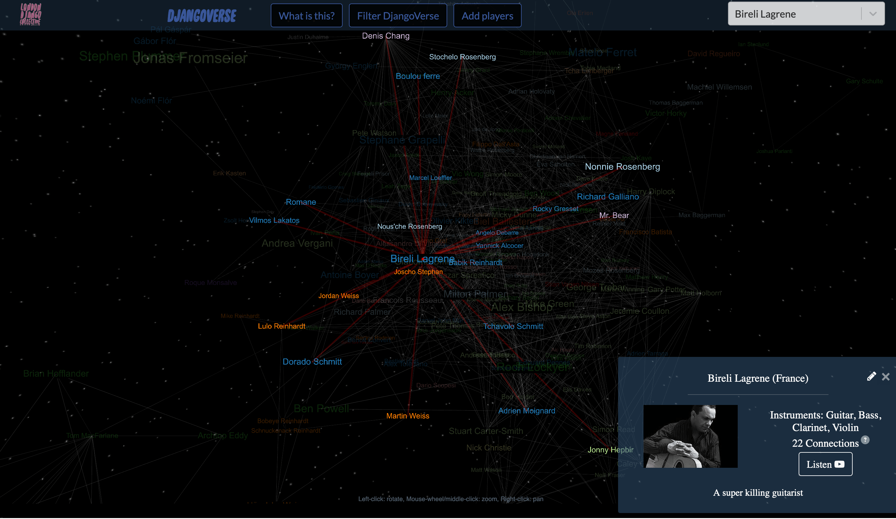

## DjangoVerse

The [DjangoVerse](http://www.londondjangocollective.com/djangoverse) is a 3D graph of players in the Gypsy Jazz scene around the world. The different colours correspond to different countries. Two players are linked if they have gigged together. Anyone can [add players](http://www.londondjangocollective.com/api/forms/player/add) or [edit existing players](http://www.londondjangocollective.com/api/forms/player/list).

This is built using React and [D3's force directed graph](https://github.com/vasturiano/react-force-graph), with a Django [API](http://www.londondjangocollective.com/api/). This project is part of the [London Django Collective](http://www.londondjangocollective.com), and the code for the website & API can be found [here](https://github.com/jeremiecoullon/LDC/).
